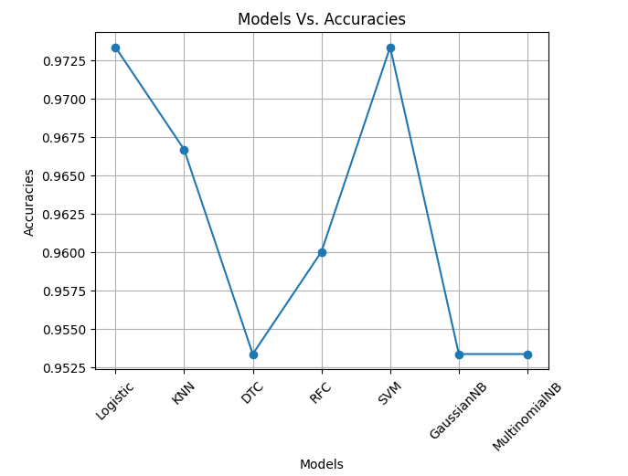
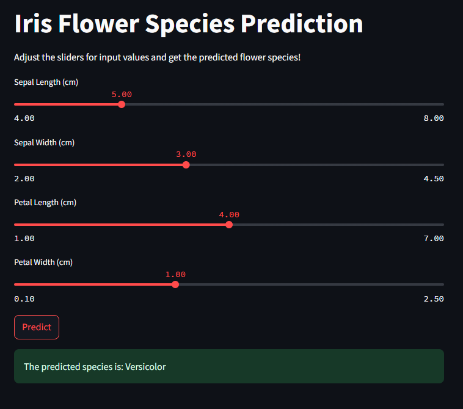
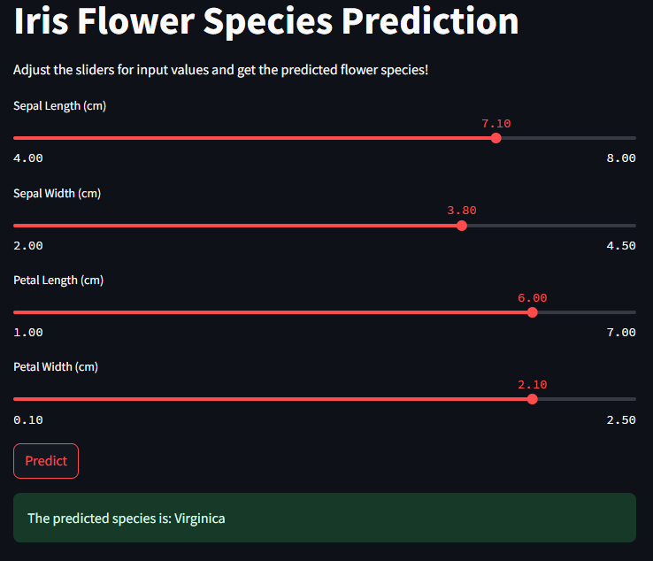
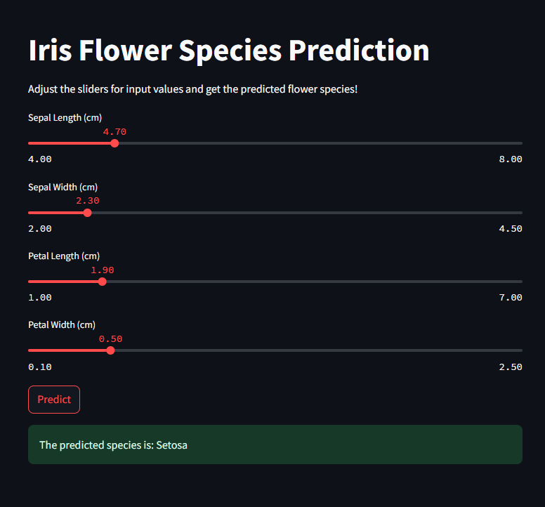

# Iris Flower Species Prediction with Streamlit

## Table of Contents
1. [Project Overview](#project-overview)
2. [Tech Stack](#tech-stack)
3. [Data Preprocessing](#data-preprocessing)
4. [Model Building](#model-building)
5. [Model Evaluation](#model-evaluation)
6. [Streamlit Web Application](#streamlit-web-application)
7. [How to Clone and Run](#how-to-clone-and-run)
8. [Results](#results)
9. [Conclusions](#conclusions)
10. [License](#license)

## Project Overview

The goal of this project is to predict the species of Iris flowers based on the measurements of their sepals and petals. The dataset used in this project is the famous **Iris Flower Dataset**. The classification task involves predicting one of three possible species: Setosa, Versicolor, and Virginica. The project leverages machine learning models to perform this classification and presents the results through a web interface built using **Streamlit**.

## Tech Stack

- **Python** 3.x
- **Streamlit** (for building the interactive web app)
- **Scikit-learn** (for machine learning)
- **Matplotlib** & **Seaborn** (for visualizations)
- **Pandas** & **NumPy** (for data manipulation)
- **Git** (for version control)

## Data Preprocessing

The Iris dataset consists of 150 samples with 4 features: `sepal length`, `sepal width`, `petal length`, and `petal width`. Here’s the basic preprocessing done:

1. **Loading Data**: Using Pandas to load the dataset.
2. **Exploratory Data Analysis (EDA)**: Performed using Seaborn to visualize the distributions and relationships of the features.
3. **Splitting Data**: The data was split into training and test sets using a **80-20 split**.

## Model Building

Various machine learning models were built and evaluated:

1. **Logistic Regression**
2. **K-Nearest Neighbors (KNN)**
3. **Decision Tree Classifier**
4. **Random Forest Classifier**
5. **Support Vector Machine (SVM)**
6. **Gaussian Naive Bayes**
7. **Multinomial Naive Bayes**

These models were trained using **k-fold cross-validation** (k=10) to ensure robustness.

## Model Evaluation

We evaluated the models based on **accuracy** scores. The performance of each model is shown in the bar plot below:

### Model Evaluation Graph



## Streamlit Web Application

The Streamlit web app allows users to interact with the trained model. The user can input the sepal and petal dimensions via sliders, and the app will predict the species of the Iris flower based on the input.

### Screenshot of Streamlit App







## How to Clone and Run

To clone the repository and run the project locally, follow these steps:

1. Clone the repository:
   ```bash
   git clone https://github.com/UmerSalimKhan/Iris-Flower-Species-Prediction-with-Streamlit.git
   ```

2. Navigate into the project folder:
   ```bash
   cd Iris-Flower-Species-Prediction-with-Streamlit
   ```

3. Install the required dependencies:
   ```bash
   pip install -r requirements.txt
   ```

4. Run the Streamlit app:
   ```bash
   streamlit run app.py
   ```

This will open the Streamlit web app in your browser where you can input values and get predictions.

## Results

The best model in terms of accuracy was **Logistic Regression**, which achieved an accuracy of over 97%. This model was deployed in the Streamlit app for interactive use.

## Conclusions

In this project, we successfully built and evaluated multiple machine learning models to predict the species of Iris flowers. The Logistic Regression model showed the best performance, and we deployed this model in a web application using Streamlit, making it accessible for real-time predictions.

## License

This project is licensed under the MIT License.
